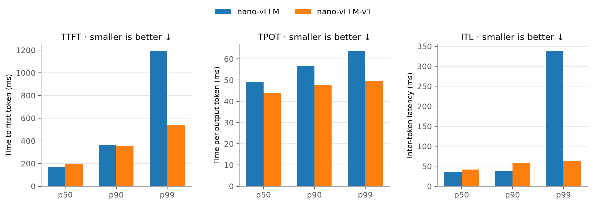
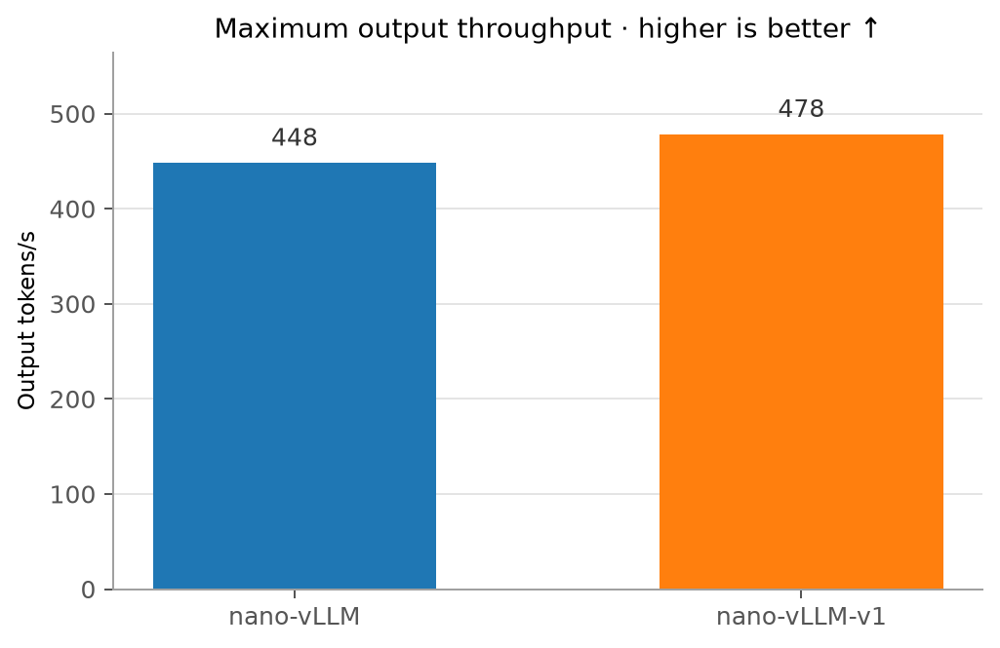

# nano-vllm benchmark

Minimal performance comparison between [nano-vllm](https://github.com/GeeeekExplorer/nano-vllm) and [nano-vllm-v1](https://github.com/junuxyz/nano-vllm-v1).

## Install

Install uv

```bash
curl -LsSf https://astral.sh/uv/install.sh | sh
source "$HOME/.local/bin/env"
```

Clone the repository and install dependency

```bash
git clone --recurse-submodules \
  https://github.com/junuxyz/nano-vllm-bench.git
cd nano-vllm-bench

uv sync
```

Download Qwen3-8B to the persistent workspace:

```bash
uv run hf download Qwen/Qwen3-8B \
  --local-dir /workspace/huggingface/Qwen3-8B
```

## Run benchmark

### Rate-limited

```bash
uv run python bench.py \
  --engine nano-vllm \
  --model /workspace/huggingface/Qwen3-8B \
  --num-requests 256 \
  --request-rate 2 \
  --min-input-len 128 \
  --max-input-len 2048 \
  --min-output-len 64 \
  --max-output-len 256 \
  --max-model-len 4096 \
  --token-budget 512 \
  --max-num-seqs 64 \
  --enforce-eager \
  --output results/nano-vllm-rate-2.json

uv run python bench.py \
  --engine nano-vllm-v1 \
  --model /workspace/huggingface/Qwen3-8B \
  --num-requests 256 \
  --request-rate 2 \
  --min-input-len 128 \
  --max-input-len 2048 \
  --min-output-len 64 \
  --max-output-len 256 \
  --max-model-len 4096 \
  --token-budget 512 \
  --max-num-seqs 64 \
  --enforce-eager \
  --output results/nano-vllm-v1-rate-2.json
```

### Maximum throughput

```bash
uv run python bench.py \
  --engine nano-vllm \
  --model /workspace/huggingface/Qwen3-8B \
  --num-requests 256 \
  --request-rate inf \
  --min-input-len 128 \
  --max-input-len 2048 \
  --min-output-len 64 \
  --max-output-len 256 \
  --max-model-len 4096 \
  --token-budget 512 \
  --max-num-seqs 64 \
  --enforce-eager \
  --output results/nano-vllm-rate-inf.json

uv run python bench.py \
  --engine nano-vllm-v1 \
  --model /workspace/huggingface/Qwen3-8B \
  --num-requests 256 \
  --request-rate inf \
  --min-input-len 128 \
  --max-input-len 2048 \
  --min-output-len 64 \
  --max-output-len 256 \
  --max-model-len 4096 \
  --token-budget 512 \
  --max-num-seqs 64 \
  --enforce-eager \
  --output results/nano-vllm-v1-rate-inf.json
```

Both engines are run with `--enforce-eager` due to CUDA graph issues in nano-vLLM-v1 ([issue #2](https://github.com/slwang-ustc/nano-vllm-v1/issues/2), [PR #3](https://github.com/slwang-ustc/nano-vllm-v1/pull/3)).


## Results

Results were measured on:
- 1 x RTX 4090 with Qwen3-8B
- 256 requests
- 128-2,048 input tokens
- 64-256 output tokens
- eager execution

### Rate-limited latency (Request rate = 2)



At 2 requests/s, both engines sustain about 309 output tokens/s, while nano-vLLM-v1 reduces p99 TTFT from 1,189 ms to 536 ms, p99 TPOT from 63.5 ms to 49.6 ms, and p99 ITL from 337 ms to 62.6 ms.

### Maximum throughput (Request rate = inf)



With all requests submitted immediately, nano-vLLM-v1 slightly increases output throughput from 448 to 478 tokens/s.

This generally aligns with Sarathi-Serve’s result: mixed batching reduces generation stalls, improving tail latency while providing a modest throughput gain.
